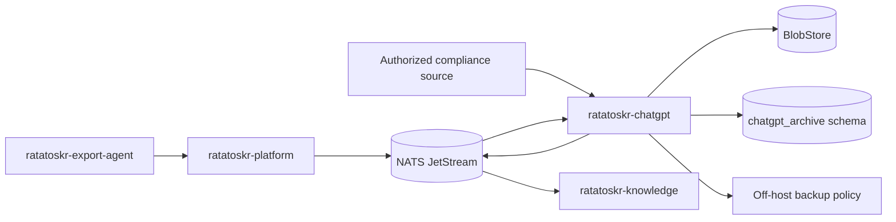
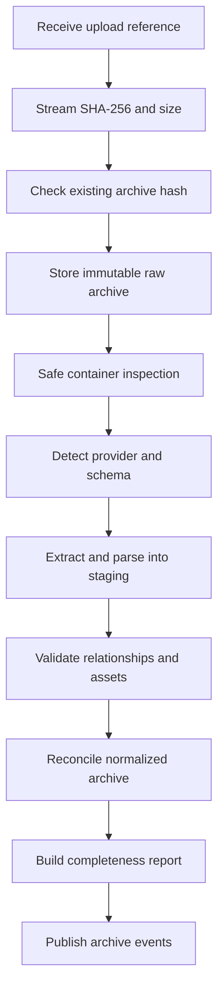

# Ratatoskr ChatGPT Archive Architecture

> Status: target architecture. This repository is in architecture bootstrap. Export formats and enterprise APIs are external contracts and must be handled through versioned adapters and real fixtures.

## 1. Purpose

`ratatoskr-chatgpt` creates a local, immutable, searchable archive of ChatGPT product data.

It owns:

- official consumer and workspace export archives;
- optional enterprise/education compliance ingestion;
- ChatGPT accounts/workspaces as archive identities;
- projects and project metadata;
- conversations as branching graphs;
- messages and heterogeneous content parts;
- uploaded and generated files;
- Canvas and other discovered assets;
- provider-specific raw records;
- snapshot/revision history;
- import completeness reports;
- portable Markdown/JSON archive generation.

It is not an OpenAI inference gateway and does not equate OpenAI API Conversations with ChatGPT product history. It does not automate consumer website login or store browser sessions.

## 2. Architectural position



The archive service owns provider-specific raw and normalized archive state. Knowledge owns analysis and search projections; Platform owns public operations and identity.

## 3. Repository structure

```text
ratatoskr-chatgpt/
├── crates/
│   ├── chatgpt-domain/
│   ├── archive-intake/
│   ├── schema-detection/
│   ├── export-parsers/
│   ├── reconciliation/
│   ├── projects/
│   ├── conversations/
│   ├── assets/
│   ├── completeness/
│   ├── portable-export/
│   ├── compliance-adapter/
│   ├── persistence/
│   ├── eventing/
│   ├── telemetry/
│   └── test-support/
├── services/
│   └── chatgpt/
├── migrations/
├── fixtures/
│   ├── synthetic-exports/
│   └── malformed-archives/
├── tests/
└── docs/
```

Consumer exports and compliance ingestion share the normalized archive domain but remain separate acquisition adapters.

## 4. Bounded context and data ownership

Recommended schema:

```text
chatgpt_archive.accounts
chatgpt_archive.workspaces
chatgpt_archive.provider_exports
chatgpt_archive.import_runs
chatgpt_archive.import_warnings
chatgpt_archive.projects
chatgpt_archive.project_revisions
chatgpt_archive.project_sources
chatgpt_archive.conversations
chatgpt_archive.conversation_revisions
chatgpt_archive.messages
chatgpt_archive.message_revisions
chatgpt_archive.message_edges
chatgpt_archive.content_parts
chatgpt_archive.attachments
chatgpt_archive.assets
chatgpt_archive.canvases
chatgpt_archive.citations
chatgpt_archive.unknown_records
chatgpt_archive.completeness_reports
chatgpt_archive.tombstones
chatgpt_archive.compliance_cursors
chatgpt_archive.outbox
chatgpt_archive.inbox
```

The service writes only to `chatgpt_archive.*`.

It does not own public sessions, OpenAI model API state, embeddings, cross-provider search, or storage-backend retention policy.

## 5. Acquisition modes

```text
ConsumerExport
WorkspaceExport
ComplianceLog
ManualConversationCapture
LegacyImport
```

Each record retains acquisition mode and source snapshot. Normalized objects can combine observations from multiple acquisitions without losing provenance.

### 5.1. Consumer export

For personal accounts, the supported path is a user-requested official archive downloaded and delivered through Export Agent or an explicit upload.

```text
request export in ChatGPT
-> download archive
-> place in Ratatoskr Inbox or upload
-> Export Agent hashes and sends archive
-> ChatGPT service stores and imports snapshot
```

This is snapshot-based backup, not continuous synchronization.

### 5.2. Compliance mode

An authorized compliance adapter may ingest conversation/activity records programmatically.

The adapter owns:

- API authentication;
- cursor/checkpoint state;
- page/retry handling;
- provider record preservation;
- mapping to normalized archive entities;
- reconciliation with periodic full exports when available.

Compliance data is not assumed to contain every project asset. Completeness remains evidence-based.

## 6. Raw-first archive intake

The original provider archive is the primary evidence and is stored before parsing.



### 6.1. Archive identity

A provider export record includes:

```text
provider export ID when available
account/workspace reference
acquisition mode
requested/received/imported timestamps
archive SHA-256 and size
raw BlobRef
parser version
detected schema
import status
completeness status
warnings
```

The same hash is imported idempotently unless an explicit parser reprocessing request is made.

## 7. Safe archive handling

Archives are hostile input.

Controls:

- reject absolute paths and path traversal;
- cap file count, nesting, compressed bytes, and decompressed bytes;
- detect archive bombs and duplicate-path ambiguity;
- reject unsupported links/device files;
- MIME sniff rather than trust extension;
- never execute files or scripts;
- do not render active HTML during import;
- isolate temporary extraction;
- derive BlobStore keys from content hashes;
- clean temporary data after durable import state is recorded;
- preserve unknown files as raw evidence when policy allows.

File names are display metadata, never storage paths.

## 8. Schema detection and parser architecture

### 8.1. Detection

Detection uses archive structure, manifest fields, JSON shape, and known filenames. It returns:

```text
provider confidence
detected export family
schema/version candidate
required parser
unknown sections
warnings
```

A weak match may be preserved without normalization rather than parsed incorrectly.

### 8.2. Versioned parser interface

```rust
pub trait ExportParser {
    fn parser_id(&self) -> ParserId;
    fn supports(&self, detected: &DetectedSchema) -> bool;
    fn parse(&self, source: &ArchiveView) -> Result<StagedExport, ParseError>;
}
```

Parsers produce staging records, not direct current projections.

### 8.3. Unknown data

Unknown JSON fields, record types, content parts, and files are retained as bounded raw records with source path/hash and warnings. They can be reprocessed by a future parser without requesting a new provider export.

## 9. Durable import state machine

```text
received
-> raw_stored
-> inspected
-> schema_detected
-> parsing
-> staged
-> validating
-> reconciling
-> reporting
-> completed
```

Alternative states:

```text
duplicate
partial
failed_transient
failed_permanent
quarantined
cancelled
```

A restart resumes from durable stage boundaries. No import is marked completed before normalized transactions and completeness report are committed.

## 10. Project model

A project is versioned and may contain:

- provider project ID;
- title and description;
- custom instructions;
- memory/configuration metadata when present;
- owner/workspace reference;
- visibility and sharing metadata;
- conversation membership;
- uploaded files and pasted text;
- saved responses or generated assets;
- external references;
- creation/update/archive/delete observations.

```text
projects
project_revisions
project_sources
project_conversation_memberships
project_visibility_observations
```

### 10.1. Source kinds

```text
UploadedFile
PastedText
SavedResponse
GeneratedFile
Canvas
GoogleDriveReference
SlackReference
ExternalReference
Unknown
```

An external reference is not considered locally backed up unless the referenced content has a local BlobRef or another owning service confirms preservation.

### 10.2. Project completeness

A project can be present while instructions, membership, sharing state, or sources are missing from the export. Completeness is tracked per project component rather than one optimistic boolean.

## 11. Conversation graph

Conversations are graphs, not flat ordered lists.

```rust
pub struct ArchivedMessage {
    pub id: MessageId,
    pub conversation_id: ConversationId,
    pub external_id: Option<String>,
    pub parent_message_id: Option<MessageId>,
    pub role: MessageRole,
    pub content: Vec<ContentPart>,
    pub model: Option<String>,
    pub created_at: Option<DateTime<Utc>>,
    pub updated_at: Option<DateTime<Utc>>,
    pub provider_metadata: serde_json::Value,
}
```

### 11.1. Supported graph semantics

- edits of earlier user messages;
- regenerated assistant responses;
- branch-from-message workflows;
- incomplete/interrupted responses;
- tool/system records when present;
- shared or moved conversations;
- conversation membership changes.

A derived branch view chooses one path through the graph. The archive retains all known branches.

### 11.2. Message identity

Provider message ID is used when stable. Otherwise the importer derives an observation identity from conversation, parent, role, timestamps, and content hash while preserving uncertainty.

## 12. Content parts

```text
Text
Markdown
Image
File
Code
Citation
ToolCall
ToolResult
Canvas
GeneratedAsset
Unknown
```

Each content part retains:

- order within the message;
- provider type and raw metadata;
- normalized representation;
- attachment/asset reference;
- content hash;
- source export and record location.

Unknown parts remain round-trippable.

## 13. Attachments and assets

### 13.1. Attachment model

```text
attachment ID
provider ID when available
original filename
MIME and detected MIME
size and SHA-256
raw BlobRef
message/project relationships
first/last observed export
availability/completeness state
```

### 13.2. Generated assets

Generated images, documents, code files, and other outputs are stored as separate assets with provider/source relationships. A message reference without bytes becomes a missing-asset warning, not a fabricated attachment.

### 13.3. Canvas

Canvas-like documents are versioned artifacts. The archive preserves raw provider representation plus normalized text/code where safely available.

## 14. Citations and external references

Citations retain:

- provider citation metadata;
- displayed title/URL;
- source message/content part;
- optional local document/blob link;
- observation timestamp.

External URLs are not automatically fetched by this service. Eligible article URLs can be sent to Extractor through a separate command with user policy.

## 15. Snapshot and revision semantics

Each export is an immutable snapshot.

Rules:

- never replace the original ZIP;
- normalized current projections are derived from observations;
- changed objects create revisions;
- one export missing an object does not prove deletion;
- explicit provider deletion records, compliance events, or repeated authoritative evidence may create tombstones according to policy;
- access loss, export omission, and deletion are distinct states;
- hard deletion is governed by local retention, not upstream absence alone.

Possible upstream states:

```text
present
missing_from_latest_snapshot
explicitly_deleted
access_lost
unknown
```

## 16. Reconciliation architecture

Staged records are reconciled by stable provider IDs where available.

Priority:

1. provider object ID;
2. provider composite identity;
3. deterministic content/relationship fingerprint;
4. unresolved new local identity with warning.

Reconciliation:

- upserts observations and revisions;
- preserves existing objects not present in the current snapshot;
- links projects, conversations, messages, and assets;
- records unresolved references;
- updates current projection only after validation;
- produces change events.

## 17. Completeness reports

Completeness is produced per export and aggregated by project/conversation.

Example dimensions:

```text
projects discovered
conversations discovered
messages discovered
branches resolved
attachments referenced
attachments stored
missing attachments
project instructions present
project membership present
Canvas/assets present
unknown record variants
unresolved relations
```

Statuses:

```text
Complete
ConversationsComplete
StructurallyPartial
AssetsPartial
Unknown
FailedValidation
```

`Complete` requires explicit parser evidence, not merely no errors.

## 18. Compliance ingestion

The compliance adapter is optional and isolated.

Architecture:

```text
scheduled/continuous pull
-> durable cursor
-> raw provider event storage
-> idempotent event mapping
-> normalized observation/revision
-> outbox event
-> periodic reconciliation against full export when available
```

Requirements:

- least-privilege enterprise credential;
- bounded polling and retry;
- cursor advancement only after durable processing;
- provider retention window awareness;
- audit records;
- no assumption that logs contain all project assets/settings.

## 19. Portable local export

Ratatoskr can generate a provider-independent archive:

```text
project-name/
├── project.json
├── README.md
├── instructions.md
├── conversations/
│   ├── conversation-id.json
│   └── conversation-id.md
├── sources/
├── canvases/
├── attachments/
├── assets/
└── manifest.json
```

The portable export includes:

- source snapshot IDs and hashes;
- normalized graph representation;
- readable branch renderings;
- asset hashes;
- missing/unknown warnings;
- schema version.

It is not presented as an importer back into ChatGPT unless an official supported import exists.

## 20. Knowledge integration

The service publishes normalized project, conversation, and asset events.

Knowledge may index:

- message windows;
- conversation branches;
- whole-conversation summaries;
- projects and project sources;
- Canvas/generated assets.

Knowledge receives source references and allowed content, never provider credentials. Search projections can be deleted/rebuilt without affecting archive authority.

## 21. Commands and events

### 21.1. Commands consumed

```text
chatgpt.export.import_requested.v1
chatgpt.export.reprocess_requested.v1
chatgpt.portable_export.requested.v1
chatgpt.compliance.sync_requested.v1
chatgpt.archive.reconcile_requested.v1
```

### 21.2. Events emitted

```text
chatgpt.export.received.v1
chatgpt.export.ingested.v1
chatgpt.export.partial.v1
chatgpt.export.failed.v1
chatgpt.project.upserted.v1
chatgpt.conversation.upserted.v1
chatgpt.asset.stored.v1
chatgpt.completeness.reported.v1
chatgpt.portable_export.completed.v1
```

Events reference blobs and records; they do not embed full private conversations or exports.

## 22. Persistence and transactions

Transactions group:

- import state transitions;
- staging-to-normalized reconciliation;
- revision/current projection updates;
- completeness report metadata;
- outbox records.

Archive upload, parsing, and BlobStore operations occur outside database transactions but have durable intermediate states.

At-least-once command/event delivery is handled with idempotency keys and inbox deduplication.

## 23. Privacy and retention

Chat archives may contain highly sensitive personal and professional data.

Controls:

- encrypted transport and storage;
- user/tenant authorization on every archive query;
- no content in logs or metric labels;
- optional local-only Knowledge processing;
- configurable raw prompt/response and portable-export retention;
- separation of metadata and content access;
- explicit purge workflow with audit and BlobStore deletion verification;
- no cross-user deduplication that reveals content equality;
- private fixtures are never committed to the repository.

Temporary/incognito conversations are backed up only if present in an authorized source. The service does not claim completeness for data the provider does not export.

## 24. Failure model

### Transient

- upload interruption;
- BlobStore or database outage;
- compliance API timeout/rate limit;
- worker interruption.

### Permanent or quarantined

- invalid/unsupported archive;
- archive safety violation;
- schema too ambiguous for normalization;
- corrupted asset hash;
- authorization mismatch.

### Partial

- conversations parsed but projects incomplete;
- referenced attachments missing;
- unknown record variants preserved;
- relationships unresolved;
- compliance events available without project assets.

Partial imports remain queryable with warnings and never masquerade as complete.

## 25. Security boundaries

- No consumer browser login automation, passwords, cookies, or undocumented session endpoints.
- Official user exports and authorized compliance APIs are the supported acquisition paths.
- Archives and contained files are hostile input.
- Provider credentials are isolated to the compliance adapter.
- File names do not become filesystem paths.
- Active HTML/scripts are never executed during import.
- Events/logs exclude messages, files, tokens, signed URLs, and raw exports.
- Unknown records are stored as data, not evaluated.
- External links do not trigger actions without separate commands and policy.
- Public clients access archive data only through Platform-authorized APIs.

## 26. Observability

Required telemetry:

```text
chatgpt_exports_received_total
chatgpt_export_bytes
chatgpt_import_duration_seconds
chatgpt_import_status_total
chatgpt_projects_imported_total
chatgpt_conversations_imported_total
chatgpt_messages_imported_total
chatgpt_assets_stored_total
chatgpt_missing_assets_total
chatgpt_unknown_records_total
chatgpt_unresolved_relations_total
chatgpt_compliance_lag_seconds
chatgpt_completeness_status_total
queue_lag_seconds
```

Metrics contain counts and sizes, not titles, message text, file names, or provider IDs as unbounded labels.

## 27. Testing architecture

### Unit

- archive fingerprint/idempotency;
- schema detection;
- parser mapping;
- graph construction and branch traversal;
- revision and snapshot semantics;
- completeness classification;
- portable manifest generation;
- retention decisions.

### Integration

- SQLx migrations and reconciliation transactions;
- BlobStore raw archive/assets;
- interrupted/resumed import;
- outbox/inbox replay;
- fake compliance pagination/cursors;
- Knowledge event generation.

### Adversarial

- path traversal and absolute paths;
- archive bombs and excessive files;
- malformed JSON and mixed schemas;
- duplicate/ambiguous IDs;
- active HTML/script assets;
- oversized files;
- missing referenced assets;
- unknown content parts.

### Fixture strategy

Only synthetic or explicitly sanitized private fixtures are used. Real personal exports remain outside Git and are referenced through secure local test configuration.

### Workspace end-to-end

- Export Agent upload and operation progress;
- raw-first import and completeness report;
- project/conversation viewer;
- Knowledge indexing and search;
- portable export;
- duplicate archive handling;
- off-host backup verification.

## 28. Deployment architecture

Runtime roles may include:

```text
archive intake/internal API
import worker
reconciliation worker
portable export worker
optional compliance sync worker
```

They may share one image with separate concurrency and NATS permissions.

Dependencies:

- PostgreSQL `chatgpt_archive` role;
- NATS JetStream;
- BlobStore;
- optional compliance secret/API access;
- Platform registered-device upload flow.

No browser, ChatGPT session cookie, OpenAI inference credential, or direct Knowledge database access is required.

## 29. Migration architecture

Legacy ChatGPT captures/imports are migrated with `LegacyImport` provenance.

1. Preserve original files and metadata.
2. Store raw legacy artifacts in BlobStore.
3. Map known conversations/messages without inventing project relationships.
4. Preserve unknown structures.
5. Import first official export snapshot.
6. Reconcile stable provider IDs and content hashes.
7. Build completeness report.
8. Index normalized records through Knowledge.
9. Keep legacy and official acquisition evidence separately traceable.

## 30. Architectural invariants

1. The service archives ChatGPT product data, not OpenAI API conversation state.
2. Official exports are stored immutably before parsing.
3. Consumer acquisition does not use browser-session automation.
4. Parsers are versioned and driven by detected schema.
5. Archives and contained files are hostile input.
6. Conversations are graphs, not flat lists.
7. Unknown records and content parts are preserved.
8. Projects can be structurally partial even when conversations parse successfully.
9. One missing object in a snapshot does not prove deletion.
10. Revisions preserve prior evidence.
11. Completeness is evidence-based and explicit.
12. Knowledge indexing does not own archive authority.
13. Provider credentials remain in the optional compliance adapter.
14. Events contain references, not private conversation bodies.
15. Delivery is at-least-once and handlers are idempotent.
16. Portable exports are readable backups, not claimed provider imports.

## 31. Evolution

Initial milestones:

1. Raw archive intake, hashing, BlobStore, and durable import state.
2. Real-fixture schema discovery and first versioned consumer parser.
3. Conversation graph, content parts, and attachments.
4. Projects, sources, Canvas/assets, and completeness reports.
5. Platform/Export Agent integration.
6. Knowledge events and local search/viewer.
7. Portable Markdown/JSON export.
8. Parser reprocessing and unknown-record tooling.
9. Optional compliance adapter with cursor/reconciliation.
10. Retention, purge, off-host verification, and recovery runbooks.

Changes to archive authority, deletion semantics, consumer-session policy, or completeness rules require ADRs and coordinated workspace changesets.
